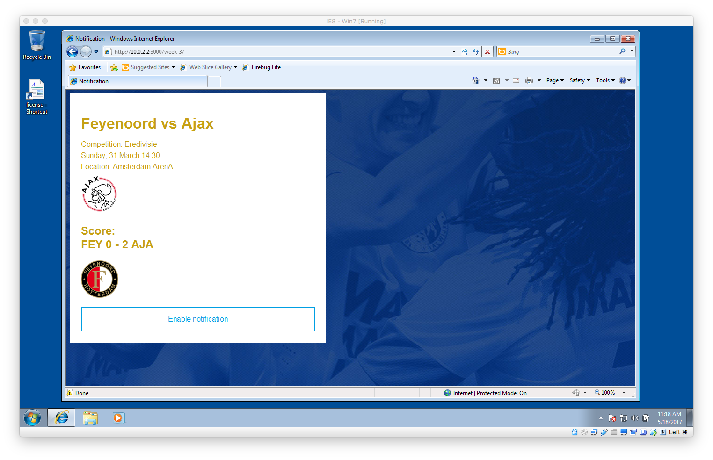
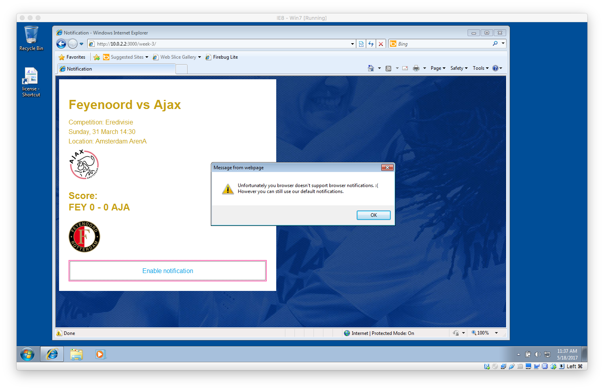
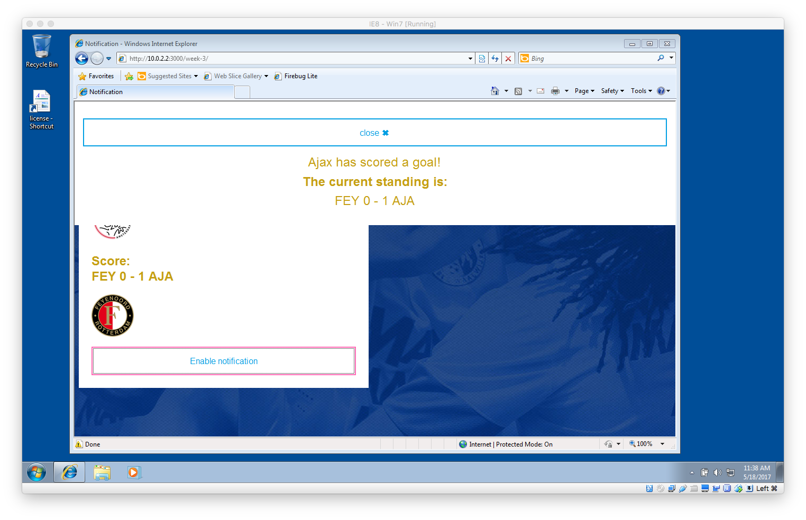

# minor-bt resit

To finish this course I had to complement the following requirements:
* Make sure Data is coming from one source
* Internet Explorer doesn't fully work

**Below is a changelog:**

## Database simulation
The scores shown on screen and in the notification where hardcoded values in the code. Now I've simulated a database with `put` and `get` commands coming from the `data.js` file in the `index.html`. By loading it trough `index.html` the variables become available in `script.js`.

```
<script type="text/javascript" src="./data/data.js"></script>
```

I've made a database object:
```
//Database object
var db = {
  // Put request simulate
  put: function(id, data) {
    this.data[id] = data;
  },
  // Get request simulate
  get: function(id) {
    return this.data[id];
  },
  // Store data object
  data: {}
}

// Scores in data object
db.put(0, {FEY: '0', AJA: '1'});
db.put(1, {FEY: '0', AJA: '2'});
db.put(2, {FEY: '0', AJA: '3'});
```

**All the scores in the HTML, lightbox and Notification API come from the database object.**

## Internet Explorer Fix

There were several issues I came across reviewing my code and testing it in `virtualbox`.

### AttachEvent
Before I used `addEventListener` to make sure the button clicks worked. This isn only supported *IE > 9*. Turn out Microsoft has a alternative for IE, AttachEvent. As stated on [MDN](https://developer.mozilla.org/en-US/docs/Web/API/EventTarget/attachEvent):
> This is a proprietary Microsoft Internet Explorer alternative to the standard EventTarget.addEventListener() method.

So to make this work I do a quick check using an `if else` statement to check if attachEvent is in window. Otherwise `onclick` is used.

### Query Selector
Before I used a querySelector to access the lightbox DOM element. This is only supported *IE > 9*. I've replaced all of it with `getElementById` and `getElementsByTagName` which are DOM core level 2 properties and thus supported *IE6+**

### Semantic HTML
Some of the styling didn't work on IE < 9. I used a couple of HTML5 semantic element which aren't supported, the CSS selector didn't work and the styling wouldn't show at all.

In theory the notifications will work even back to IE6 but couldn't test properly. Tested using **Virtualbox IE8 win7**. Below are some screenshots:


**Sreenshots**



