# Funda Feature Check

This is a summary of the featurecheck I did on my own funda created for the Minor Web Development. I checked the app with 8 features that where discussed during the class *Browser Technologies*. All of them with a description of the feature and screenshots with the result.

**Tested on chrome**
* Chrome version: 57.0.2987.98 (64-bit)
* Seperate user with no extensions / plugins installed

## Table of contents
- [1. Images](#images)
- [2. Custom Font](#fonts)
- [3. JavaScript](#javascript)
- [4. Color](#color)
- [5. Internet](#internet)
- [6. Cookies](#cookies)
- [7. localStorage](#storage)
- [8. Keyboard](#keyboard)
- [Screen Reader](#screenreader)
- [Device lab Testing](#devicelab)

## TL;DR
* [ ] Add noscript tag
* [ ] Implement fallback for images (placeholder?)
* [ ] Refactor CSS variables or use a fallback
* [ ] Implement correct focus styles and fix radio input problems
* [ ] Add alt tags to images

##  1. Images
When I disbale images in the chrome settings the app works fine. Most of the titles are descriptive. Only the images used for presentational purposes (header images / splash screen illustration) aren't showing up but that doesn't make the app unusable. The big game changer is that the images of the houses don't show which can be a critical letdown.

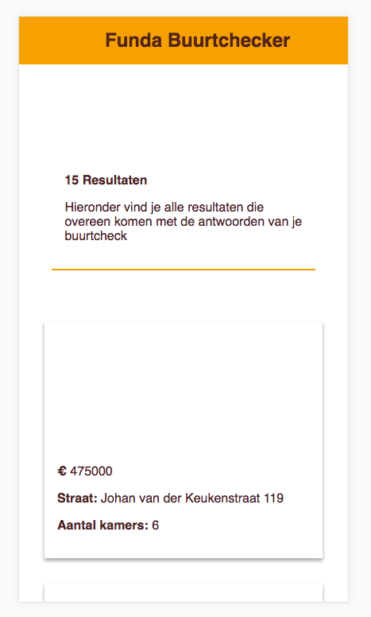

##  2. Custom Font
The default font is the system font (sans-serif) so there are no custom fonts being loaded. For some of the icons I used emoji's which won't render in all browsers but for emoji's the fallback is UTF-8 characters.

**Solution:**  
If icons or fonts don't show up. Use the right fallback (system font) and use SVG icons.

##   3. JavaScript
Without the JavaScript the app is broken 🎉🙄
The app will load and you can navigate to the first page but JS handles the enabling and disabling of the fieldset so the user won't be ablem to complete the form and the API request doesn't fire.

**Solution:**  
You could refactor the app in a more tradition way using seperate HTML pages.

##  4. Color
With [Sim Daltonism](https://michelf.ca/projects/sim-daltonism/) and [Contrast Ratio](https://leaverou.github.io/contrast-ratio/I) I checked the colors used in the Funda app. The app uses the branding colors of the Funda website. The background color, accent color and contrast are all pretty good and couldn't find any major issues.

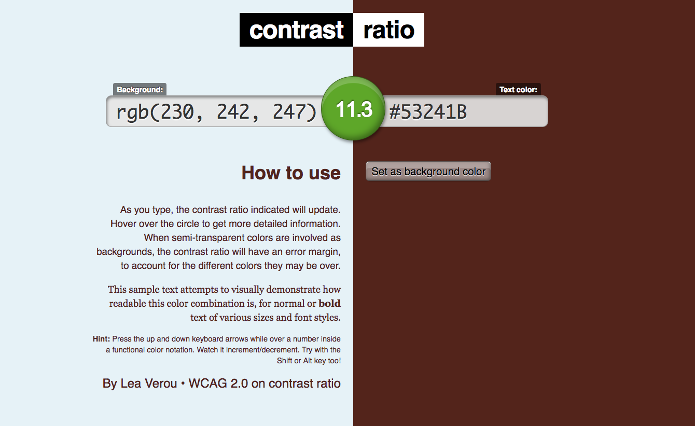
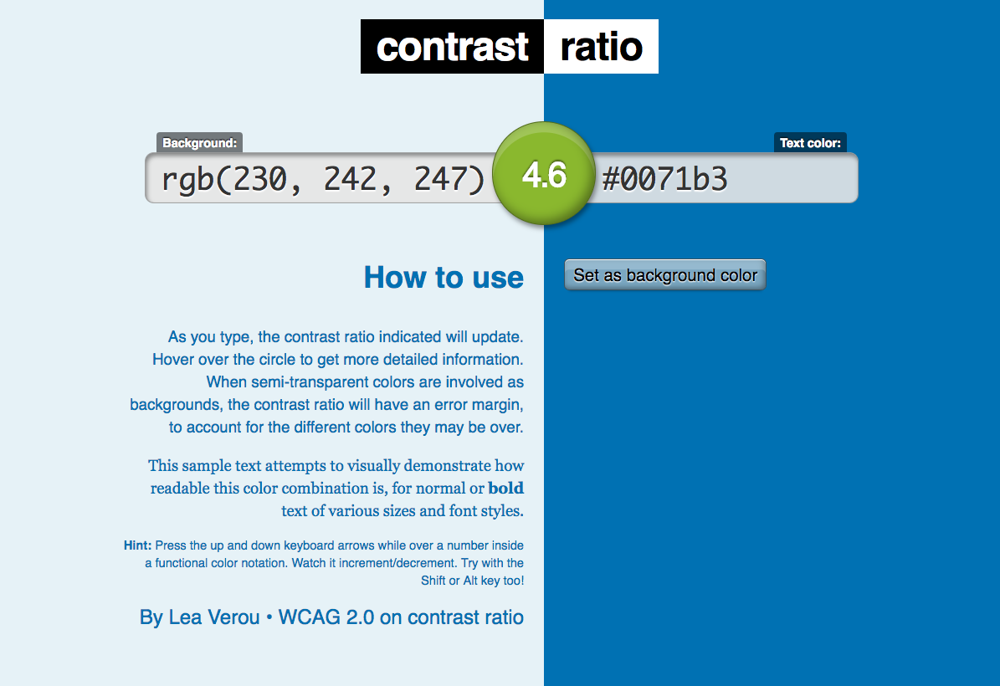
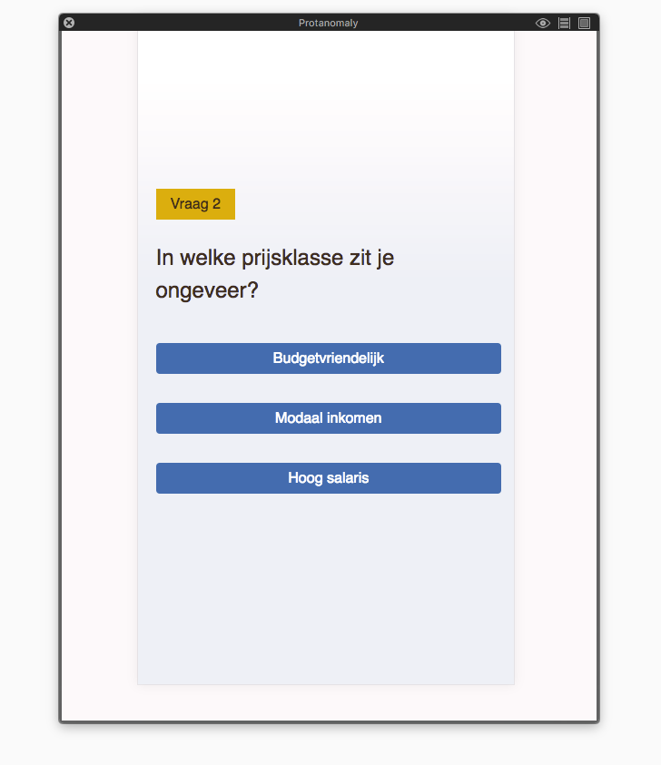
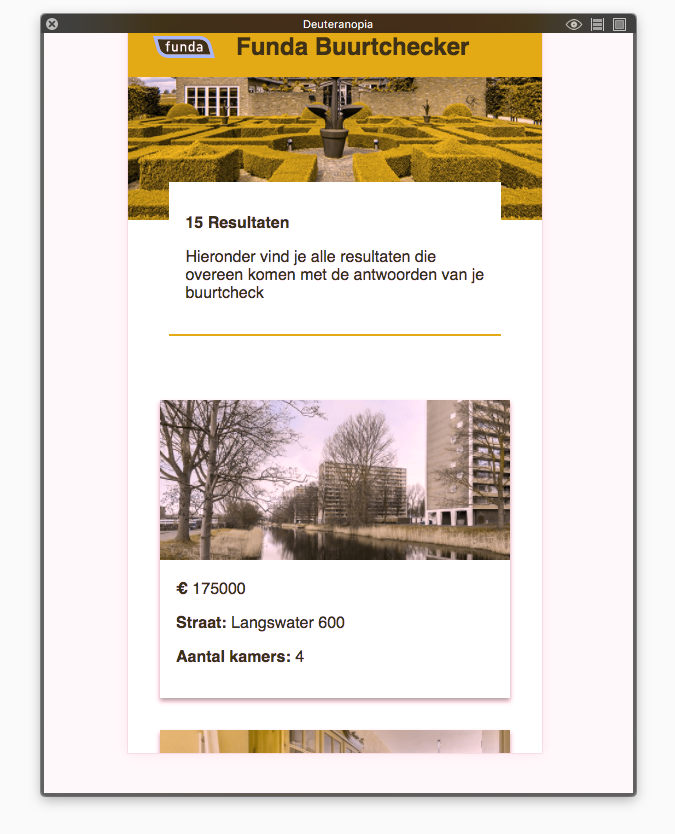
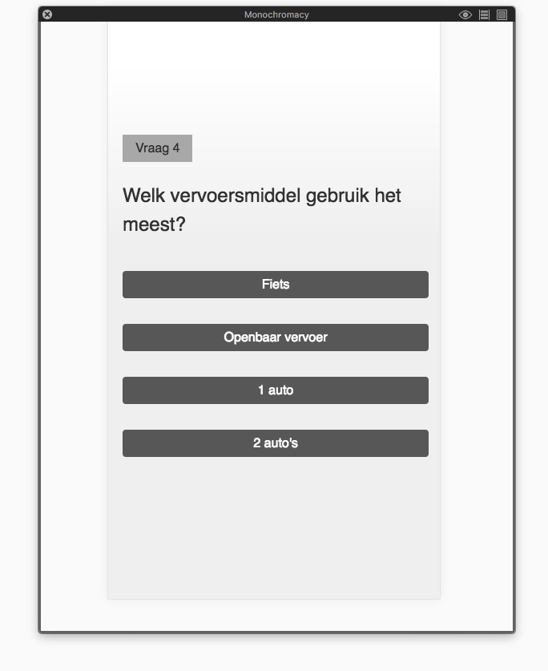

##  5. Broadband Internet
By throttling in the Chrome DevTools I checked how the SPA performed with a slow internet connection. **Regular 2G**

The whole app after the splash screen is basically 1 form with multiple fieldsets that gets toggled. So on the initial load it has to download 3 resources (index.html / style.css / app.js) and that finishes in **1.27 seconds**.

The results page where the API request fires also loads in that time but is still needs to fetch the images, do the DOM loads very fast but the loading of the images takes around **15 seconds**.

**Percieved performance**  
To create smooth transitions to the screens I added some CSS3 animations which may result in a slower percieved performance but a better overall user experience.

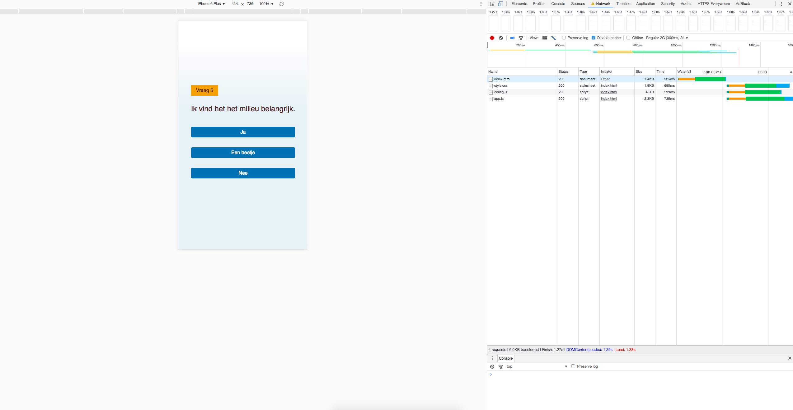
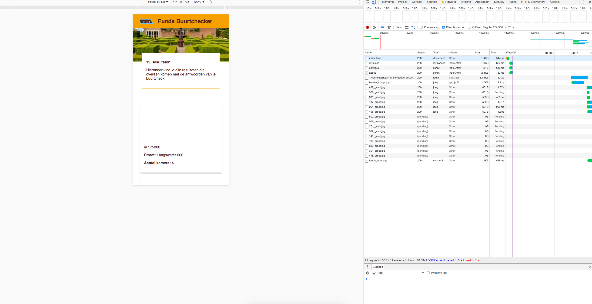

##   6. Cookies
I dont use cookies, so it wasn't a problem when I disabled cookies in the chrome settings.

##  7. localStorage
The same as cookies, localStorage (web storage) isn't used in the app.

**Solution**  
Maybe I can leverage the use of localStorage to store the API request and the images. So when a user enters the quiz exactly the same or the same houses show up after the query I can store them.

##  8. Keyboard
Because it is one big form most of the input and labels can be tabbed to and the query also fires automaticcaly after the last fieldset has been completed. There seems to be an issue with the tabindex of the radio buttons input type and I will need to look into that.

I also added a anchor tag to the cards of the houses so that when the query has fires you can tab through all the results. When you enter you will be taken to the funda website.

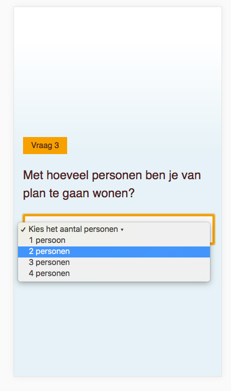
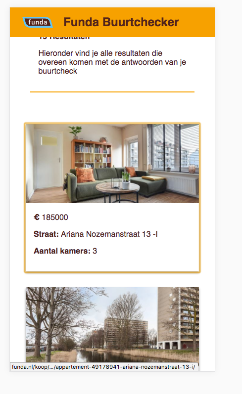

##  Screen Reader

*The built in Voice over program in mac is pretty powerful. I've enabled the native voice over (screen reader) program in mac.*

This topic is closely related to the previous keyboard use of the application. There is a bug in the radio buttons which doesn't let the user tab through the site very well. It reads all the input fields and links outloud which work pretty good. But...

the reading of the DOM is a disaster. I disable the fieldsets using JavaScript but they are not removed from the DOM which causes the screen reader to read the whole quiz (whole DOM) instead of just one question.

I'm finding some trouble to correctly use the Screen Reader but maybe that takes some googling. Now I have to use the mouse to let the Screen Reader read the headings an paragraphs and thay can be done through the keyboard.

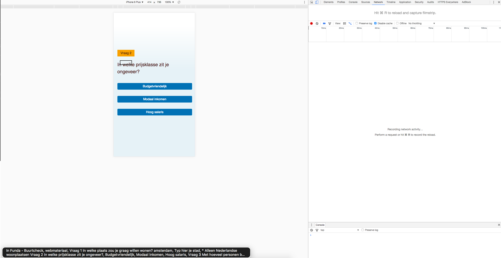
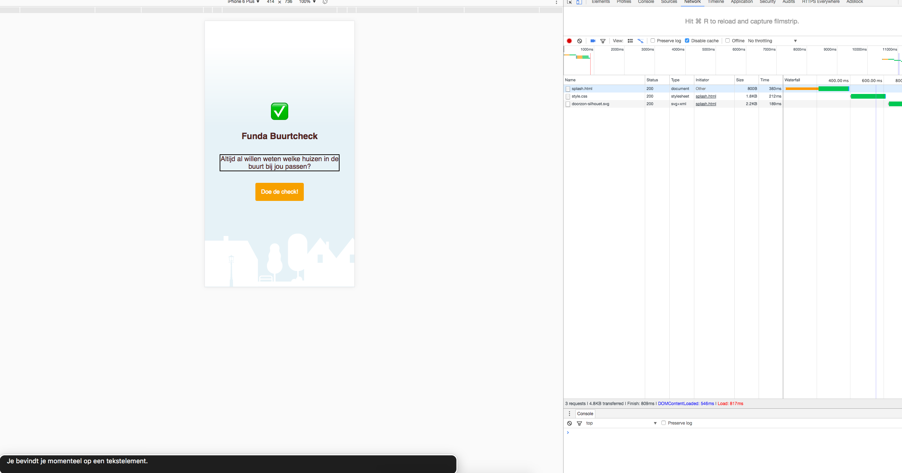

##  Device Lab Testing
Most of the current smartphones handle the SPA pretty well. It was build mobile first en when you move to a tablet or desktop viewport everything gets centered. So that's not optimal but still pretty usable. On Internet Eplore the colors are broken, that's becuase I used CSS variables and haven't provided a fallback.

I was suprisinngly positive about the workings of the SPA on the kindle and windows phone. Most of the HTML is pretty semantic which those phones render pretty well. Only some of the emoji encoding doesn't work and the layout sometimes exceed the viewport which is a pretty big issue.

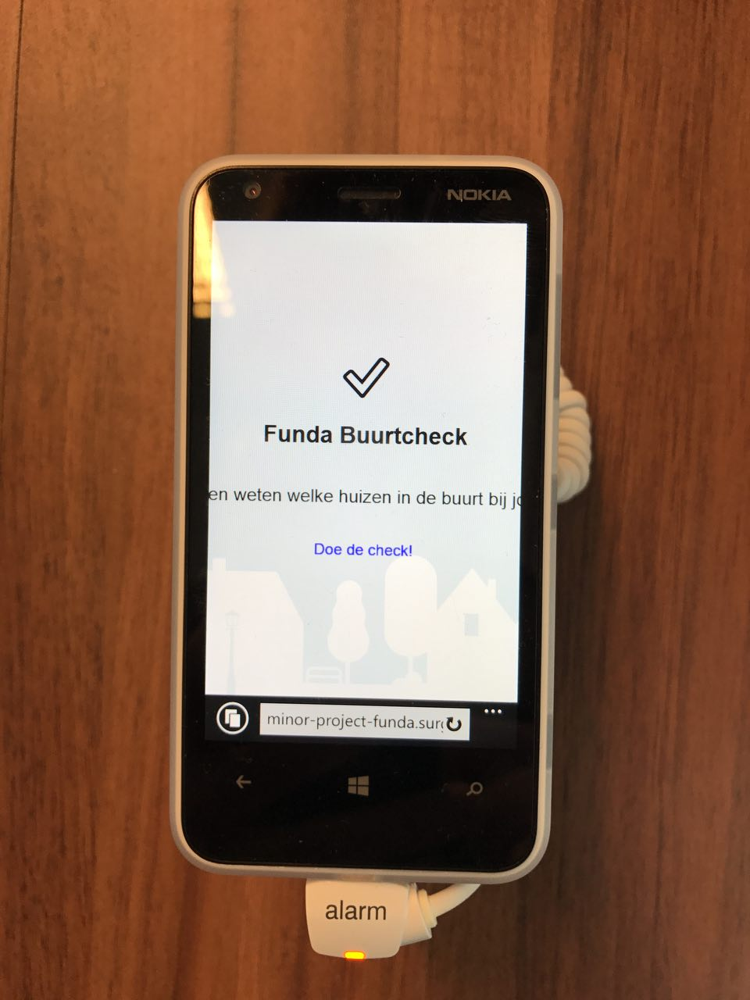
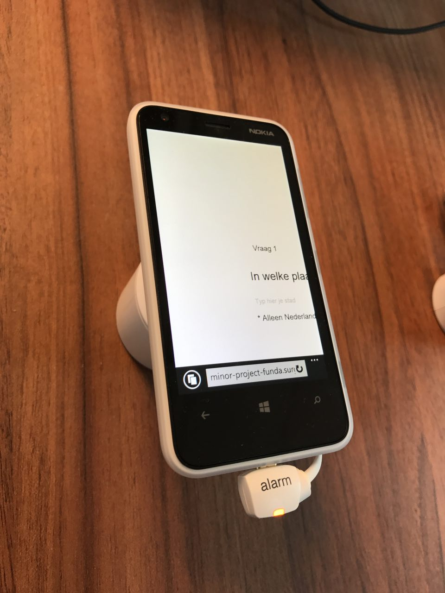
