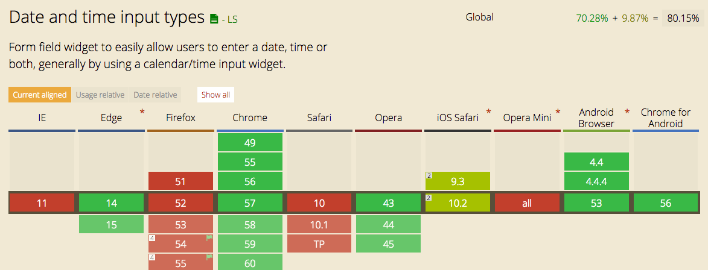

# Feature 1.

## Demo
[Link to live demo](https://dandevri.github.io/minor-bt/week-2/feature-1/feature-1.html)

## Description of the Feature
The date input easily allows users to enter a date by using a calendar widget.

## Fallback
The fallback for `input type="date"` is the default `input type="text"` which for most users makes it unclear what to input.

If the browsers doesn't support `input type="date"` the JavaScript kicks in adding the expected input from the user.

## Browser support

## Resources
[Can I Use](http://caniuse.com/#search=date)  
[Mozilla Developer Network](https://developer.mozilla.org/en-US/docs/Web/HTML/Element/input/date)
