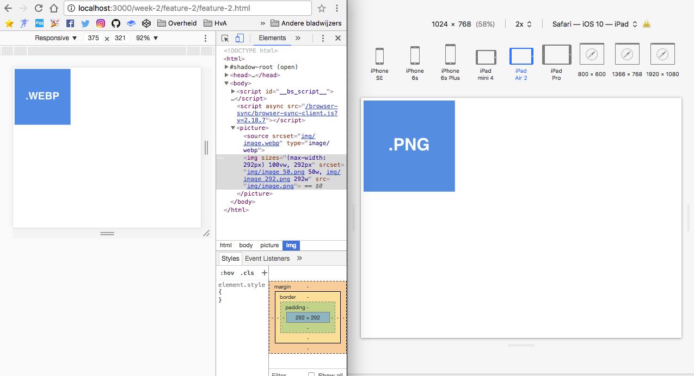
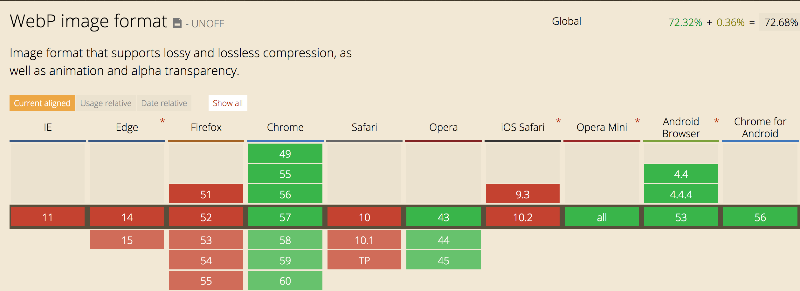
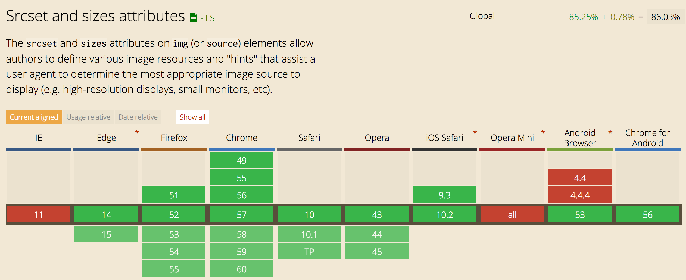

# Feature 2.

## Demo
[Link to live demo](https://dandevri.github.io/minor-bt/week-2/feature-2/feature-2.html)

## Description of the Feature
WebP is a modern image format that provides superior lossless and lossy compression for images on the web. But the WebP image format is only suporten in Chrome and Opera.

## Fallback
With the `picture` element and `source` you can determine which resource is presented trough the user agent. So when the client supports the source tag and `webp` format it will render that image. Otherwise it will move on to the `img src`.

Inside the `img` tag you can even specify `srcset` for size control.

## Browser support
Internet explorer doesn't support the `picture and srcset` tags.

## Resources
[Can I Use](http://caniuse.com/#search=picture)  
[Responsive Breakpoints](http://www.responsivebreakpoints.com/)  
[Google Developers](https://developers.google.com/speed/webp/)  
[Mozzila Developer Network](https://developer.mozilla.org/en/docs/Web/HTML/Element/picture)
