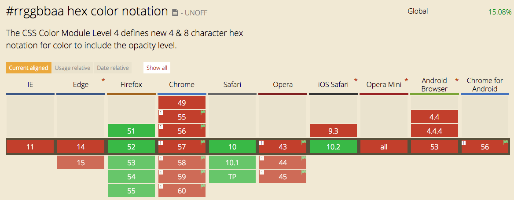

# Feature 3.

## Description of the Feature
In the new CSS module 4 a new 8-digit hex scheme is introduced to support alpha values. The value of alpha in the new hex notation would range from 00 to FF where 00 is the minimum value i.e 0% and FF is the max value which would be 100% opacity.

## Fallback
`rgba` and `hsla` already support alpha channel but is buggy in some older versions of Internet Explorer. With the new hex color notation you can insure your alpha channel is consitent in every browser becuase it falls back to the original hex value.

## Browser support

## Resources
[ChomeStatus](https://www.chromestatus.com/feature/5685348285808640)  
[Can I use](http://caniuse.com/#search=hex)  
[CSSwg draft](https://drafts.csswg.org/css-color/#hex-notation)
