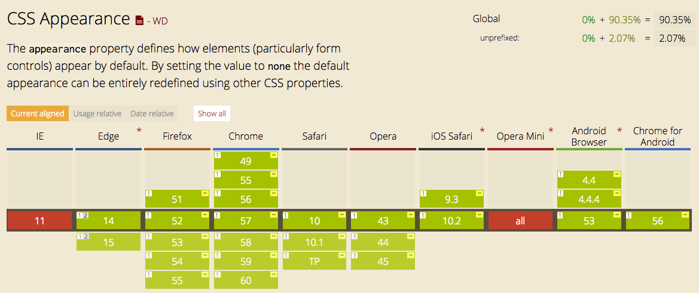

# Feature 4.

## Demo
[Link to live demo](https://dandevri.github.io/minor-bt/week-2/feature-4/feature-4.html)

## Description of the Feature
Many developers love to use `appearance: none` to customize the styling of default elements such as the `select` shown in the demo. It turns of the platform-native styling from the OS.

## Fallback
The `appearance: none` property isn't that wel supported. In most of the current browsers only with a `prefix`. If the browser doesn't know the `appearance` property it shows the default browser styling.

## Browser support

## Resources
[Mozzila Developer Network](https://developer.mozilla.org/en-US/docs/Web/CSS/appearance)  
[Can I Use](http://caniuse.com/#search=appearance)  
[Stack Overflow](https://stackoverflow.com/questions/18440019/ie-firefox-custom-drop-down-could-not-remove-native-arrows)
