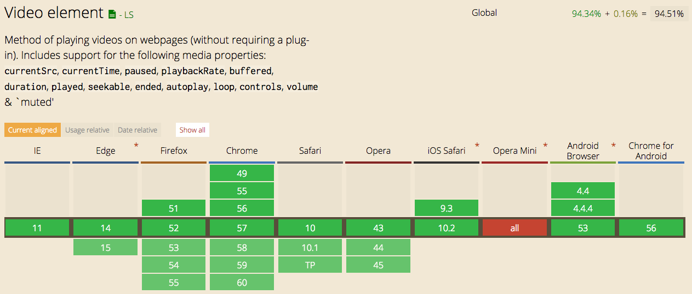

# Feature 5.

## Demo
[Link to live demo](https://dandevri.github.io/minor-bt/week-2/feature-5/feature-5.html)

## Description of the Feature
The `video` tag is used to play video's on webpages and has great support but sometimes the default HTML player offers limited controls and you don't want to host the video file on your own server.

## Fallback
* When JavaScript is enabled it will play the video with an `iframe` on youtube.
* When JavaScript is disabled if will show the video with the `video` tag.
* When the video tag isn't supported it will show an image with a `a href` to youtube.
* When JavaScript is disabled and the video tag is suported it will show a fallback text that the user needs to enable JavaScript to play the video.

## Browser support

## Resources
[Can I Use](http://caniuse.com/#search=video)  
[Mozilla Developer Network](https://developer.mozilla.org/en/docs/Web/HTML/Element/video)  
[CSS - Tricks](https://css-tricks.com/snippets/html/video-for-everybody-html5-video-with-flash-fallback/)
