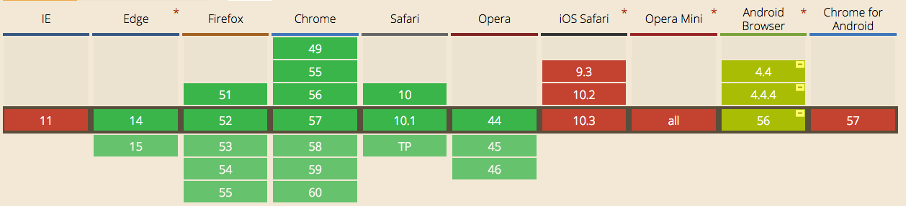
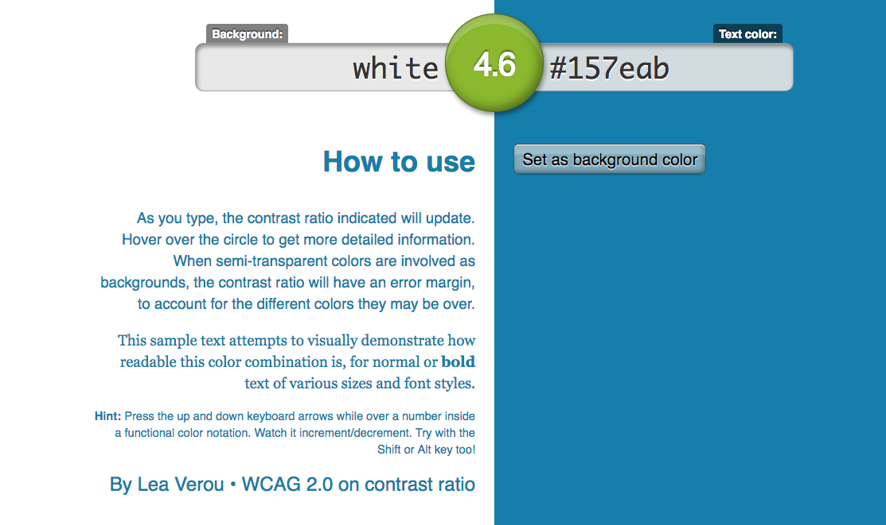
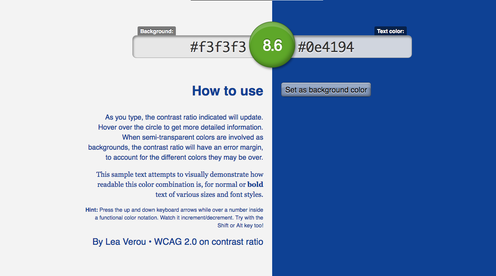
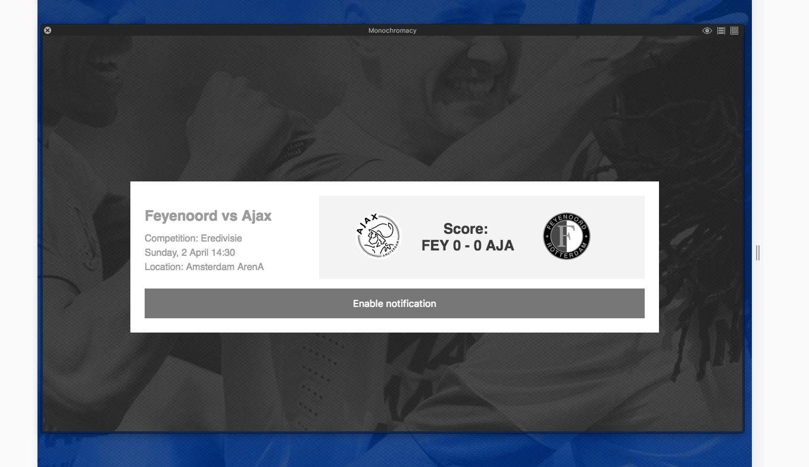
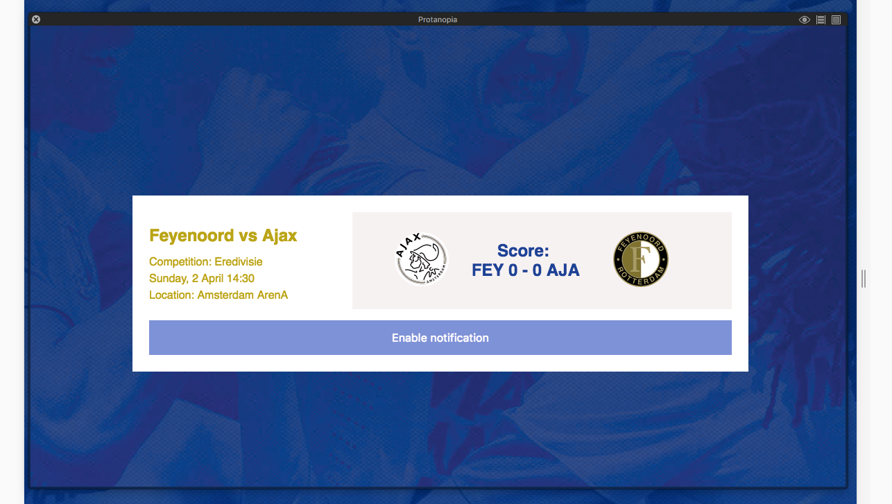

# ⚽️ Eredivisie Notifications


## Briefing
Make a demo based on the following use case:

> As a user I want to get a notification when my favorite soccer team has won a game.

Make sure all users with different browsers get the minimal functionality based on the principles of Progressive Enhancement.

## Core functionality
A notification is a broad term as found in the dictionary. It's an act or instance of notifying or giving notice of a event that happened. Most users consider something a notification if:
* It is purposely different than the normal interface or even outside the UI
* There is a certain delay in the sending of the notification and the receival
* It has to trigger some sort of attention (affordance / visual feedback)

## Progressive Enhancement

### HTML
If `JavaScript` is disabled and only `HTML` (and `CSS`) are loaded the scores will update by refreshing the HTML thus simulating a new call to a database or api.

```html
  <meta id="next" http-equiv="refresh" content="3; URL=pages/score1.html">
```

`content`: After how much seconds the page should refresh and which page it should redirect to.

### Support
Supported in effectively all browsers (since IE6+, Firefox 2+, Chrome 1+ etc)

### CSS & JavaScript
When CSS and JavaScript are both enabled I show a lightbox that simulates a notification.

```js
document.querySelector('.lightbox-ajax').innerHTML = <HTML code>
document.getElementById('clickLightbox').addEventListener('click', clickLightbox, false);
```

With the `setTimeout` function I've delayed the firing of the function to delay the dialog.

### Support
Supported in effectively browsers above `> IE 8`.

## Notification API
To enhance the experience on Desktop browsers the Notification API is used.
> The Notifications API allows web pages to control the display of system notifications to the end user — these are outside the top-level browsing context viewport, so therefore can be displayed even the user has switched tabs or moved to a different app. The API is designed to be compatible with existing notification systems across different platforms.

Showing a system notification involves two things:
* User needs to grant permission to display system notification
* Then the notification can be created

**Constructor**  
`Notification()`: Creates new instance of the Notification object  

**Static properties**  
`Notification.permission`: Only available on the Notification object itself.

**Instance properties**  
`title, body etc.`: You can specify options for the styling / actions of the notification.

### Support


## Accessibility
### Color
I've used Sim Daltonism and Contrast Ratio Checker to check the colors of the User Interface, below are some screenshots:





### Tab
The most important tabbable features are enabling the notifications and closing a notification. Both of them are button in the HTML and they are the only button so they can be tabbed right away.

### Readability
For most of the text I used the correct heading tags so the font-size are set by default. I've increased the line-height a bit to make the slightly longer paragraphs easier to read.

### Semantic HTML / Screen reader
The most important to items on the page, clubs and the score I've used the corresponding `h1` and `h2` tags. For the rest of the pages I tried to use as many semantic `tags` as possible.
* The article has a correct header and body
* `time` tag to indicate the time of the game


## Resources
* [Can I use](caniuse.com)
* [Mozzila Developer Network](https://developer.mozilla.org/en-US/docs/Web/API/Notifications_API)
* [Sim Daltonism](https://michelf.ca/projects/sim-daltonism/)
* [Contrast Ratio Checker](https://leaverou.github.io/contrast-ratio/)
* [Branding](http://www.eredivisie.nl)
